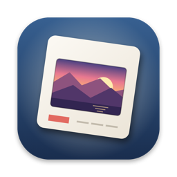

# SilverCrest SND 3600 D2 — logiciel Mac pour scanner de diapos et négatifs (Lidl)



**🇬🇧 [English](#english) · 🇩🇪 [Deutsch](#deutsch) · 🇫🇷 Français ci-dessous**

Petite appli macOS gratuite pour numériser **diapositives et négatifs** avec le scanner **SilverCrest SND 3600 D2** (Lidl), quand le logiciel fourni (ImageScan) ne fonctionne plus sur les Mac récents.

Le scanner se présente en fait comme une **caméra USB standard (UVC)**, puce Sonix `0C45:6366`, en 2592×1680. Pas besoin de pilote : l'appli lit l'image directement et fait le reste.

Testé avec le **SND 3600 D2**. Les modèles voisins (SND 3600 A2, C2, D3…) utilisent probablement la même puce : voir [Mon scanner est-il compatible ?](#mon-scanner-est-il-compatible-) pour vérifier en 10 secondes.

## English

**Mac software for the SilverCrest SND 3600 D2 slide & negative scanner (Lidl)** — for when the bundled ImageScan software doesn't work on a modern Mac (Apple Silicon or Intel, macOS 13+).

The scanner is really a standard **USB webcam (UVC, Sonix 0C45:6366, 2592×1680)**, so no driver is needed. This free native app gives you:

- live preview, scan with **Space / Return**
- **colour negatives** properly inverted (density-based, orange mask removed), B&W negatives, colour & B&W slides
- noise reduction by **averaging up to 16 frames**
- **auto-scan when you push the next slide in**, or scan on a **hand clap**
- JPEG or **16-bit TIFF**, auto-numbered files

**Install:** download `ScannerDiapo.zip` from [Releases](../../releases), move the app to Applications, then **right-click → Open** the first time (the app isn't notarised by Apple). If macOS says it's damaged: `xattr -dr com.apple.quarantine /Applications/ScannerDiapo.app`.

**Is my scanner compatible?** Plug it in and run `system_profiler SPCameraDataType` in Terminal: look for `VendorID_3141 ProductID_25446`. Other SilverCrest models (SND 3600 A2 / C2 / D3…) likely work too — please open an issue to report yours.

**Known limits:** the scanner's physical button can't be read on macOS (the UVC driver keeps that channel); exposure is controlled by the scanner itself. The interface is in French, but it's simple.

## Deutsch

**Mac-Software für den SilverCrest Dia- und Negativscanner SND 3600 D2 (Lidl)**, wenn die mitgelieferte Software (ImageScan) auf aktuellen Macs nicht mehr funktioniert (Apple Silicon oder Intel, ab macOS 13).

Der Scanner ist eigentlich eine normale **USB-Kamera (UVC, Sonix 0C45:6366, 2592×1680)**, ein Treiber ist nicht nötig. Die kostenlose App bietet Live-Vorschau, korrekte Umkehrung von **Farbnegativen** (Orangemaske wird entfernt), Dias und S/W-Negative, Rauschminderung durch Mittelung mehrerer Bilder, **automatisches Scannen beim Einschieben des nächsten Dias** oder per **Händeklatschen**, JPEG oder 16-Bit-TIFF.

**Installation:** `ScannerDiapo.zip` unter [Releases](../../releases) herunterladen, App in den Programme-Ordner ziehen, beim ersten Start **Rechtsklick → Öffnen**. Die Oberfläche ist auf Französisch, aber selbsterklärend.

**Kompatibel?** Im Terminal `system_profiler SPCameraDataType` ausführen: `VendorID_3141 ProductID_25446` sollte erscheinen. Andere SilverCrest-Modelle (SND 3600 A2 / C2 / D3 …) funktionieren wahrscheinlich auch.

---

## Français

### Fonctions

- Aperçu en direct, numérisation avec **Espace / Entrée** ou le bouton de l'appli
- Types de film : **diapo couleur**, **négatif couleur** (inversion en densité et retrait du masque orange), **négatif N&B**, **diapo N&B**
- Niveaux automatiques, exposition, contraste, saturation
- Rotation, miroirs, rognage des bords (la bande noire du scanner à gauche est retirée d'office)
- **Anti-bruit** : moyenne de 1 à 16 images par scan
- **Scan automatique** au changement de diapo : on pousse le passe-vues, l'appli attend que l'image soit stable et numérise
- **Clap des mains** pour déclencher un scan (micro du Mac, sensibilité réglable)
- Enregistrement en **JPEG** ou **TIFF 16 bits**, numérotation automatique (`diapo_0001.jpg`…), dossier au choix

### Installation

#### Version toute prête

1. Télécharger `ScannerDiapo.zip` dans les [Releases](../../releases), le décompresser et glisser **ScannerDiapo.app** dans **Applications**.
2. L'appli n'est pas signée par Apple : au premier lancement, **clic droit → Ouvrir**, puis **Ouvrir**.
   Si macOS dit que l'appli est « endommagée », lancer une fois dans le Terminal :
   ```
   xattr -dr com.apple.quarantine /Applications/ScannerDiapo.app
   ```
3. Autoriser l'accès à la **caméra** (et au **micro** si vous utilisez le clap).

macOS 13 ou plus récent, Mac Apple Silicon ou Intel.

#### Depuis les sources

Il faut seulement les outils en ligne de commande d'Apple (`xcode-select --install`), pas Xcode.

```
git clone https://github.com/meutedechien/scanner-diapo-silvercrest.git
cd scanner-diapo-silvercrest
./build.sh              # compile et installe dans /Applications
./build.sh --no-install # ou laisse ScannerDiapo.app dans le dossier
```

### Mon scanner est-il compatible ?

Brancher le scanner, puis dans le Terminal :

```
system_profiler SPCameraDataType
```

Si une caméra `VendorID_3141 ProductID_25446` apparaît (soit `0C45:6366` en hexadécimal), c'est bon.
Pour un autre scanner qui se présente aussi comme une caméra USB, il suffit de changer `scannerVID` / `scannerPID` en haut de `main.swift` ; l'appli peut alors marcher, mais ce n'est pas testé.

### Limites connues

- **Le bouton physique du scanner ne marche pas sur Mac.** Il passe par un canal de la caméra que le pilote UVC de macOS garde pour lui. D'où le scan automatique et le clap.
- L'exposition est gérée par le scanner lui-même : macOS ne permet pas de la régler sur ce type de caméra. Le curseur d'exposition agit sur l'image.
- La résolution est celle du capteur (2592×1680, un peu moins une fois rognée).

### Pour les curieux

- `main.swift` : toute l'appli (SwiftUI + AVFoundation + Core Image)
- `icon.swift` : génère l'icône (`swift icon.swift && iconutil -c icns AppIcon.iconset`)
- `test/harness.swift` : applique le traitement de l'appli à une image brute, pratique pour régler les couleurs sans scanner :
  ```
  swiftc -O -parse-as-library -D TEST main.swift test/harness.swift -o test/harness
  test/harness brut.jpg sortie.jpg negatifCouleur   # ou positif, positifNB, negatifNB
  ```

## Licence

MIT, voir [LICENSE](LICENSE).
